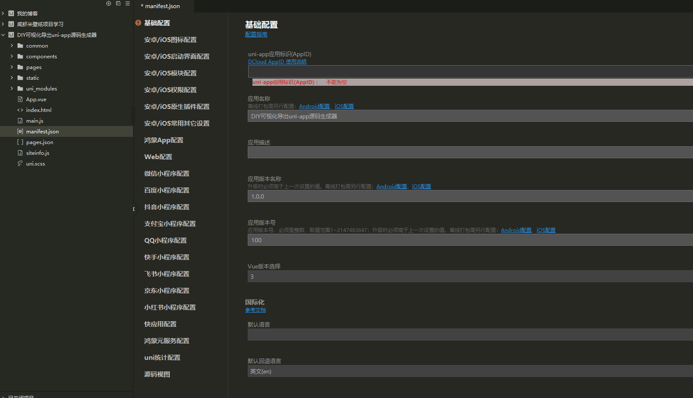

# manifest.json 配置（manifest中文意思表明，显示清楚）

`manifest.json` 位于项目根目录，是 UniApp 的**应用配置文件**。

## 可视化配置 vs 源码视图

打开 `manifest.json` 有两种模式：

- **可视化配置** — 点一点、选一选就能配（应用名称、AppID、版本号、权限开关等）
- **源码视图** — 以 JSON 代码形式配置，解决新老版本 HBuilder 功能不对等的问题

> 有些配置在可视化界面找不到，但在源码视图里可以手动添加。

---

## 什么时候需要配置？

| 场景 | 说明 |
|------|------|
| **打包上线前** | 配置应用名称、图标、AppID、版本号等 |
| **开发中用到 SDK** | 地图、支付、分享、通讯录等需要开启权限 |
| **平台政策调整** | 微信小程序等平台政策变更时，可能需要在源码视图添加新配置 |

---

## 可视化配置界面

| 配置项 | 说明 |
|--------|------|
| 应用名称 | App 显示的名称 |
| DCloud AppID | 应用标识 |
| 版本名称 | 如 `1.0.0` |
| 版本号 | 如 `100` |
| Vue 版本 | Vue 2 / Vue 3 |
| 默认语言 | 英文 / 中文 |

---

## 源码视图

某些配置在可视化界面没有，需要在源码视图手动加。

例如微信小程序获取收货地址（2022年7月后新增要求）：

```json
{
    "mp-weixin": {
        "requiredPrivateInfos": [
            "chooseAddress",
            "chooseLocation"
        ]
    }
}
```

---

## 权限配置

打包或使用以下功能需要在 manifest 中开启：

- 地图
- 支付（微信 / 支付宝）
- 消息推送
- 通讯录
- 相机 / 相册
- 定位

> **开发时没勾可能也能用，但上线前必须勾上用到的功能。**
