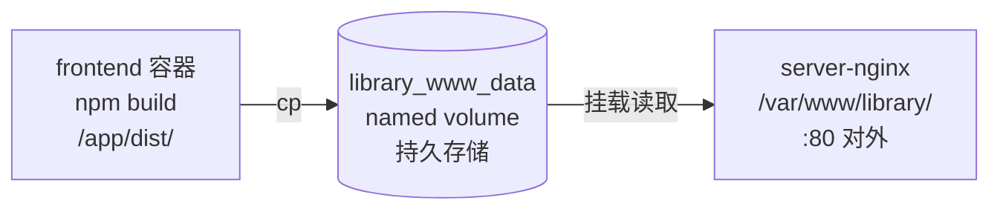

# 前端构建与部署流程

## 全链路

```
① 构建阶段 (Dockerfile.frontend)
   npm ci → npm run build → /app/dist/

② 容器启动 (CMD)
   cp -r /app/dist/* /output/
                │
③ Volume 写入        └── /output 是 volume 挂载点
   library_www_data (Docker named volume)
                │
④ Nginx 读取        └── server-nginx 挂载 library_www_data → /var/www/library
   root /var/www/library → 80 端口对外
```



## 时间线

| 阶段 | 时机 | 发生的事 |
|------|------|----------|
| 构建 | `docker build` | `npm ci` + `npm run build`，dist 写进镜像层 |
| 启动 | `docker compose up` | 挂载 volume → 容器内 `/output` |
| 拷贝 | CMD 执行 | `cp -r /app/dist/* /output/`，dist 从镜像拷进 volume |
| 退出 | 拷贝完成 | 容器退出，`restart: "no"` 不重启 |
| 读取 | 持续 | Nginx 读 volume，无需重启 |

## 更新流程

```bash
git pull
docker compose -f deploy/docker-compose.yml up -d --build
```

`--build` 重建镜像 → 新 dist → 起容器 → 覆盖 volume → Nginx 自动读到新文件。

## 相关文件

- `deploy/Dockerfile.frontend` — 前端构建镜像
- `deploy/docker-compose.yml` — frontend 服务 + volume 定义
- `deploy/server-nginx/docker-compose.yml` — Nginx + volume 挂载
- `deploy/server-nginx/library.conf` — Nginx 站点配置
